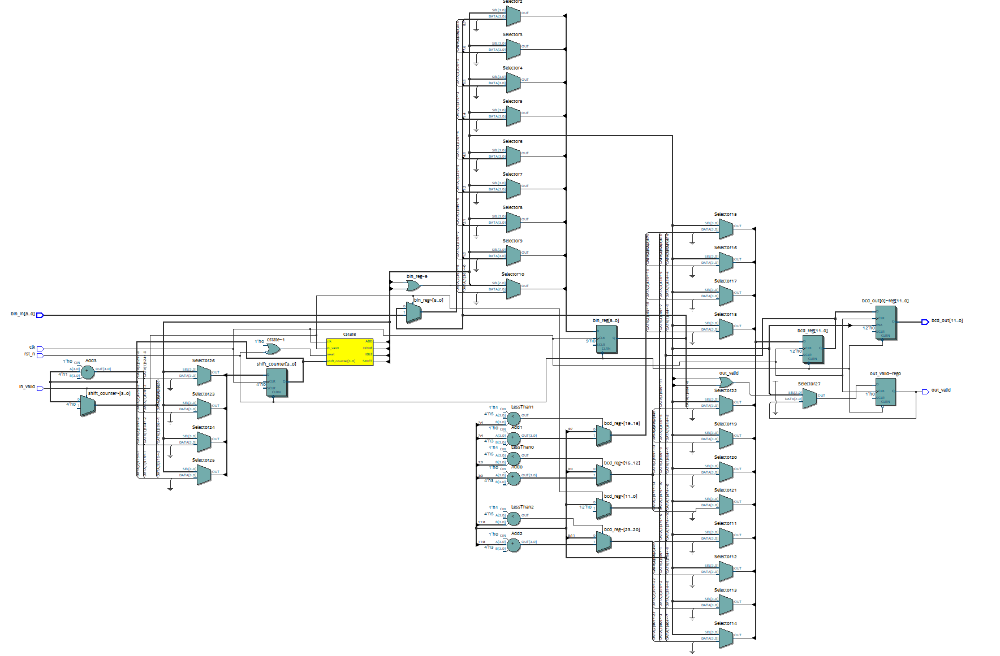
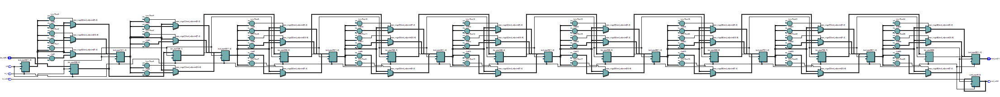
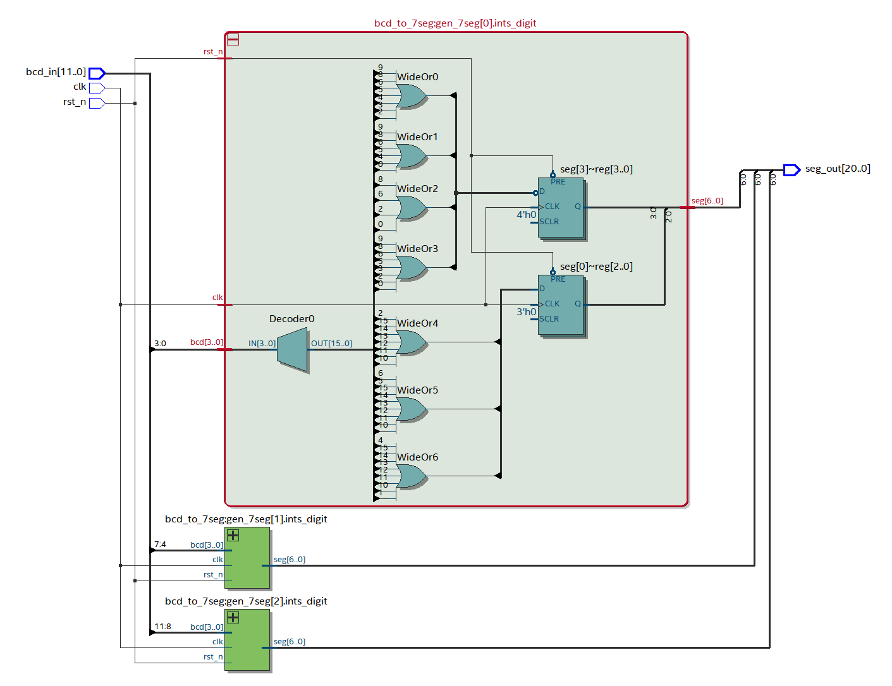
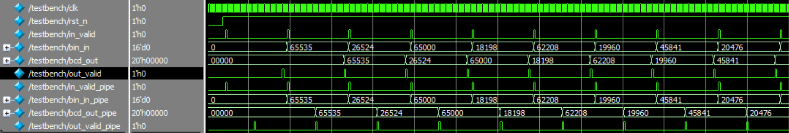
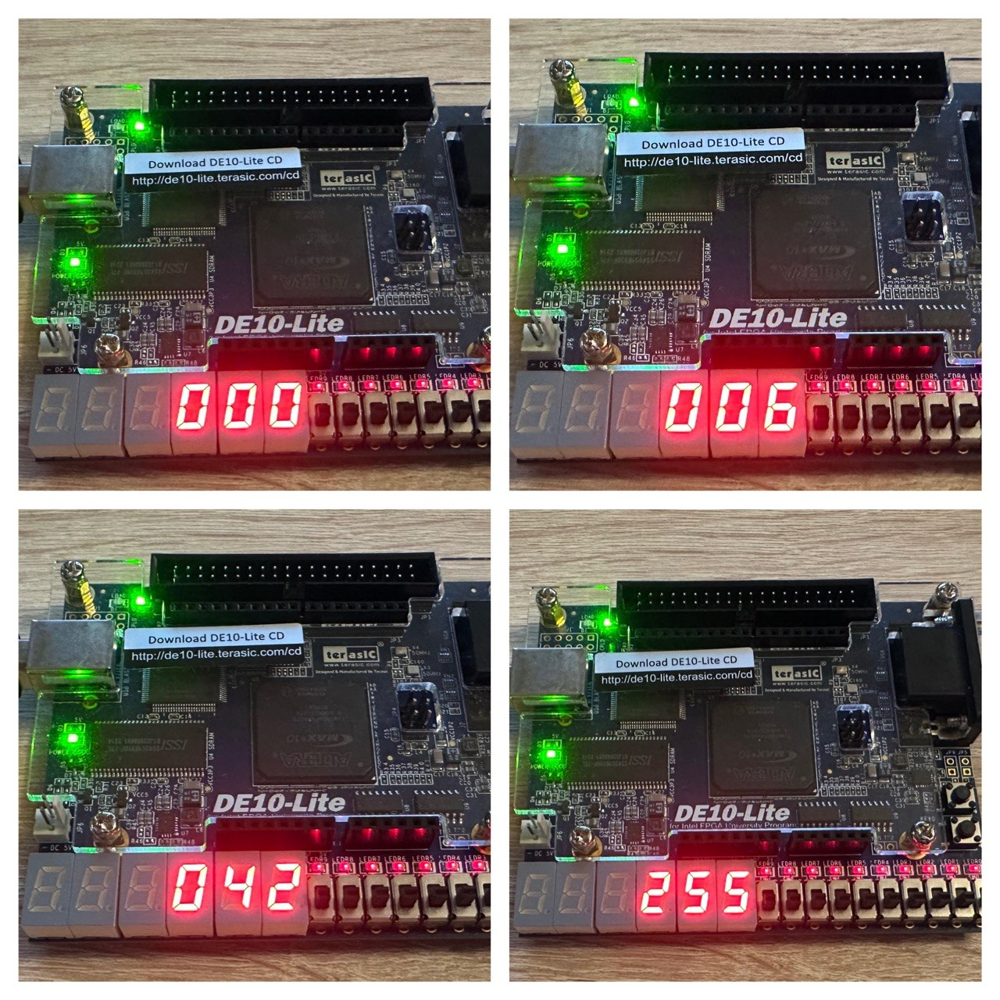

# Binary to BCD Converter
A parameterizable Binary to BCD Converters based on the **Double Dabble** algorithm and implemented in Verilog with verification using SystemVerilog Testbench.

Clone the Repo:
```
git clone https://github.com/pletnevAE/bin_to_bcd.git
```

## Overview
The **Double Dabble** algorithm converts a binary number to BCD by sequentially shifting bits left into a receiving BCD register. If the value in any BCD tetrad is 5 or greater before the next shift, 3 is added to that tetrad.

Typical applications:
+ Digital measuring equipment and control and measuring instruments;
+ Display drivers;
+ Industrial Automation;
+ Cash registers, scales and vending machines.

## Architecture
The repository presents two architectural solutions optimized by area (**bin_to_bcd.v**) and performance (**bin_to_bcd_pipeline.v**) requirements.

The output bit depth (the number of bits required to store the BCD code) is calculated based on the bit depth of the input parameter `INPUT_WIDTH` using integer approximation:

```math
\text{OUTPUT\_WIDTH} = \left( \frac{\text{INPUT\_WIDTH} \cdot 302}{1000} + 1 \right) \cdot 4
```

The constant `302/1000` approximates the value $\log_{10}(2) \approx 0.30103$ with a margin that guarantees correct memory allocation for the high-order decimal digits without using floating-point arithmetic during synthesis time.

### FSM-based Option
The **bin_to_bcd.v** module implements sequential logic and is designed according to the classic three-block finite-state machine (FSM) scheme:
1. **Block 1 (always @ (*))**: Combinatorial logic for transitions between states (`IDLE`, `ADD`, `SHIFT`, `DONE`).
2. **Block 2 (always @ (posedge clk))**: Sequential block for updating the current state register.
3. **Block 3 (always @ (posedge clk))**: Sequential data path block (shift register control, loop counter, and add-3 logic).



### Pipeline-based Option
The **bin_to_bcd_pipeline.v** module implements a spatially unfolded algorithm. The shift loop is transformed into a rigid chain of `INPUT_WIDTH` sequential hardware stages, separated by intermediate data latching registers. A validation signal (`valid`) is also advanced along the pipeline along with the data.



### BCD to 7-segment Converter
To output values ​​to 7-segment indicators, the repository contains two modules: a top-level **bcd_to_7seg_top.v** file, the parameter `DIGITS` of which specifies the number of indicators, and a lower-level **bcd_to_7seg.v** file, which is a table of output values ​​for one 7-segment indicator.


## Interface
### Parameters:
| Parameter | Default Value | Description |
|:--:|:--:|:--:|
| `INPUT_WIDTH` | 16 | Input (binary) data width |
| `OUTPUT_WIDTH` | `((INPUT_WIDTH * 302) / 1000 + 1) * 4` | Output (BCD) data width |

### Signals:
| Port | Direction | Width | Description |
|:--:|:--:|:--:|:--:|
| `clk` | Input | 1 | Clock Signal |
| `rst_n` | Input | 1 | Asynchronous Active-Low Reset |
| `in_valid` | Input | 1 | Signal to start calculating the BCD |
| `bin_in` | Input | `INPUT_WIDTH` | Input (binary) data |
| `bcd_out` | Output | `OUTPUT_WIDTH` | Output (BCD) data |
| `out_valid` | Output | 1 | BCD data valid |

## Utilization
The project was synthesized for the 10M50DAF484C6GES FPGA on the DE10-Lite board using Quartus 22.1 Standard Edition.

For `INPUT_WIDTH = 16`, `OUTPUT_WIDTH = 20`, without additional optimization modes, the following results were obtained:
| FPGA | Option | LUT | FF | Fmax, MHz | Hold Slack, ns | Setup Slack, ns |
|:--:|:--:|:--:|:--:|:--:|:--:|:--:|
| 10M50DAF484C6GES | FSM-based | 97 | 65 | 237.25 | 0.331 | 15.785 |
| 10M50DAF484C6GES | Pipeline-based | 324 | 323 | 406.83 | 0.367 | 17.542 |

## Simulation
Simulation was performed in ModelSim 10.6d. The **testbench.sv** file is self-checking and performs 3 tests: 
1) Minimum input data; 
2) Maximum input data; 
3) Random data stimulus.

The clock signal frequency is set by the `CLK_PERIOD` parameter. The number of cycles of the active reset signal is set by the `RESET_CYCLES` parameter. The number of random stimulus cycles is specified by the `RAND_CYCLES` parameter.

Testbench tests two implemented modules at once. If errors are detected, the testbench prints the total number of errors at the end of simulation.

In case of successful verification, the following message is displayed in the console:
```
[PASS] BIN TO BCD CONVERTER MODULE TESTS PASSED!
```
Waveforms window:


## Debugging in Hardware
Debugging was performed on the DE10-Lite board, `INPUT_WIDTH = 8`, `OUTPUT_WIDTH = 12`, `DIGITS = 3`. The values ​​were set using the Intel FPGA In-System Sources & Probes.

